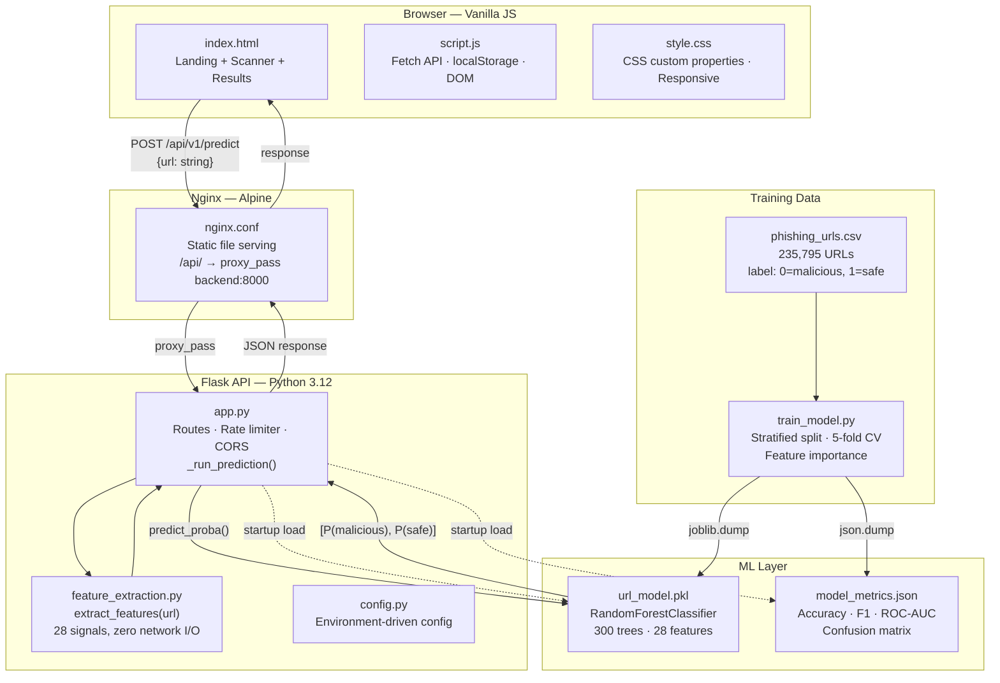
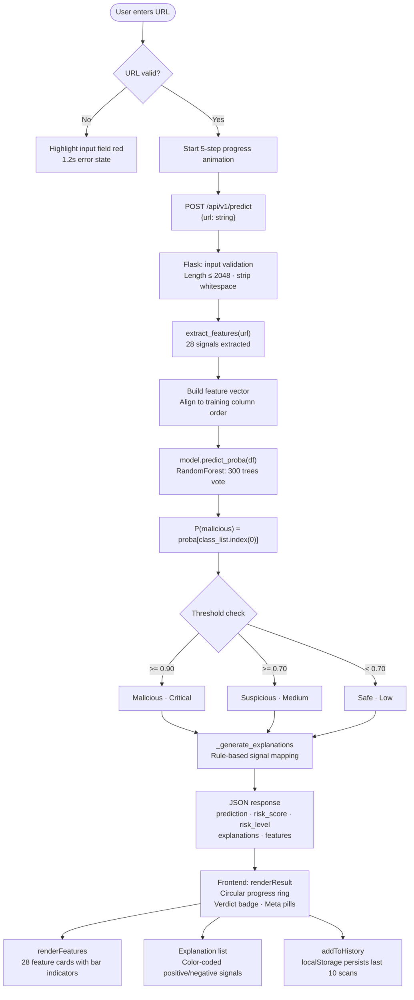

<div align="left">

# ThreatLens

### AI-Powered URL Threat Intelligence Platform

**Detect malicious URLs in milliseconds using machine learning — no black boxes, no guesswork.**

 [API Docs](#api-documentation) · [ML Pipeline](#machine-learning-pipeline) · [Architecture](#system-architecture)

</div>

---

## Executive Summary

### The Problem

Phishing attacks and malicious URLs are the leading vector for credential theft, malware delivery, and financial fraud. In 2024, over 3.4 billion phishing emails were sent daily. Traditional defenses fall short:

- **Blocklists** are reactive — they only catch URLs already reported as malicious
- **Manual review** doesn't scale — humans can't inspect millions of URLs per second
- **Simple heuristics** are easy to bypass — attackers route around keyword filters
- **Reputation services** require network calls — slow, costly, and unavailable for brand-new domains

### How ThreatLens Solves It

ThreatLens analyzes the **structure of a URL itself** — no network calls, no blocklist lookups, no external dependencies. A trained Random Forest classifier inspects 28 engineered features extracted from the URL string in pure Python, returning a verdict in under one second. Every prediction is accompanied by a plain-English explanation of exactly which signals drove the decision.

---

## Key Features

| Feature | Implementation | Detail |
|---|---|---|
| **AI Threat Detection** | `RandomForestClassifier` (300 trees) | Trained on 235,795 URLs; 99.4% accuracy on held-out test set |
| **28-Signal Feature Extraction** | `feature_extraction.py` | Entropy, length, character ratios, heuristics — pure Python, zero network I/O |
| **Explainable Predictions** | `_generate_explanations()` in `app.py` | Rule-based engine maps feature values to human-readable findings |
| **Risk Scoring** | `predict_proba()` → calibrated thresholds | Returns `P(malicious)` as a 0–1 risk score |
| **Three-tier Classification** | Threshold logic in `_run_prediction()` | Safe / Suspicious (≥0.70) / Malicious (≥0.90) |
| **Scan History** | `localStorage` with `threatlens_history` key | Last 10 scans persisted client-side; re-scannable with one click |
| **Animated Scan Progress** | 5-step progress UI in `script.js` | Sequenced step indicators synchronized with API response lifecycle |
| **Rate Limiting** | `flask-limiter` | 60 req/min on `/api/v1/predict`; 200 req/day global default |
| **CORS Support** | `flask-cors` | Configurable via `ALLOWED_ORIGINS` environment variable |
| **Docker Deployment** | Multi-stage `Dockerfile` + `docker-compose.yml` | Non-root user, Gunicorn (2 workers), Nginx reverse proxy |
| **Health Endpoint** | `GET /health` | Returns 200 OK or 503 degraded depending on model load status |
| **Model Metrics API** | `GET /api/v1/metrics` | Serves live accuracy, F1, ROC-AUC, confusion matrix from `model_metrics.json` |
| **Responsive UI** | Vanilla HTML/CSS/JS | Mobile-first layout; breakpoints at 1024px, 768px, 640px |
| **Accessibility** | ARIA roles, live regions, keyboard nav | `aria-live`, `aria-label`, `role="search"`, full keyboard support |

---

## Screenshots

| Landing Page — Hero + Metrics | |
| URL Scanner Module | `docs/screenshots/scanner.png` |
| Threat Analysis Results for safe link | 
 |
| Threat Analysis Results for risky link | 
 |

---

## System Architecture



### Component Responsibilities

| Component | Language | Responsibility |
|---|---|---|
| `frontend/index.html` | HTML5 | Single-page layout: hero, scanner, results, history |
| `frontend/script.js` | ES2022 JavaScript | API calls, DOM manipulation, localStorage, progress animation |
| `frontend/style.css` | CSS3 | Design system via custom properties, responsive grid, animations |
| `backend/app.py` | Python 3.12 | Flask routes, prediction orchestration, explanation generation, rate limiting |
| `backend/feature_extraction.py` | Python 3.12 | 28-signal URL feature engineering, zero external dependencies |
| `backend/train_model.py` | Python 3.12 | Model training, stratified split, cross-validation, metrics export |
| `backend/config.py` | Python 3.12 | Centralized environment variable configuration via `python-dotenv` |
| `nginx.conf` | Nginx | Static file serving, `/api/` reverse proxy, security headers |
| `Dockerfile` | Docker | Multi-stage build, non-root runtime user, Gunicorn entrypoint |
| `docker-compose.yml` | Docker Compose | Backend + frontend services, health checks, volume mounts |

---

## URL Analysis Workflow



---

## Machine Learning Pipeline

### Training (`train_model.py`)

The model is trained exclusively on features derivable from the URL string at inference time. This was a deliberate architectural decision to eliminate the train/inference feature mismatch that commonly plagues URL classification systems.

```
Dataset:      phishing_urls.csv  (235,795 URLs)
              label=0  →  100,945 malicious (42.8%)
              label=1  →  134,850 safe      (57.2%)

Split:        80% train (188,636)  |  20% test (47,159)
              Stratified to preserve class ratio

Model:        RandomForestClassifier
              n_estimators = 300
              max_depth    = None (fully grown)
              min_samples_leaf = 2
              class_weight = "balanced"
              random_state = 42

Validation:   StratifiedKFold(n_splits=5)
              CV F1 mean = 0.9948 ± 0.0004
```

### Model Performance

| Metric | Value |
|---|---|
| Accuracy | **99.40%** |
| Precision (malicious) | **99.41%** |
| Recall (malicious) | **99.18%** |
| F1 Score (malicious) | **99.30%** |
| ROC-AUC | **99.80%** |
| CV F1 Mean (5-fold) | **99.48% ± 0.04%** |

**Confusion Matrix** (test set, 47,159 samples):

```
                 Predicted Malicious   Predicted Safe
Actual Malicious        20,024               165
Actual Safe                118             26,852
```

### Feature Importance (Top 10)

| Rank | Feature | Importance | Signal Type |
|---|---|---|---|
| 1 | `IsHTTPS` | 39.12% | Binary protocol flag |
| 2 | `DigitRatioInURL` | 8.96% | Character ratio |
| 3 | `NoOfDegitsInURL` | 8.62% | Character count |
| 4 | `URLLength` | 8.37% | Length metric |
| 5 | `LetterRatioInURL` | 5.27% | Character ratio |
| 6 | `PathEntropy` | 4.77% | Shannon entropy |
| 7 | `NoOfLettersInURL` | 3.81% | Character count |
| 8 | `URLEntropy` | 3.63% | Shannon entropy |
| 9 | `NoOfSubDomain` | 3.37% | Domain structure |
| 10 | `DomainLength` | 3.24% | Length metric |

### Inference (`app.py → _run_prediction`)

```python
# 1. Extract 28 features from URL string
url_features = extract_features(url)

# 2. Build DataFrame aligned to training column order
row = {col: url_features.get(col, 0) for col in FEATURE_COLUMNS}
features_df = pd.DataFrame([row], columns=FEATURE_COLUMNS)

# 3. Get malicious probability
class_list    = list(MODEL.classes_)           # [0, 1]
malicious_idx = class_list.index(0)            # 0
prob = float(MODEL.predict_proba(features_df)[0][malicious_idx])

# 4. Apply calibrated thresholds
if prob >= 0.90:   verdict = "Malicious", "Critical"
elif prob >= 0.70: verdict = "Suspicious", "Medium"
else:              verdict = "Safe",      "Low"
```

---

## Feature Engineering

All 28 features are computed by `feature_extraction.py` from the URL string alone — no DNS lookups, no WHOIS queries, no external API calls.

### Length Features

| Feature Key | Description | Type |
|---|---|---|
| `URLLength` | Total characters in the normalized URL | Integer |
| `DomainLength` | Characters in the hostname | Integer |
| `TLDLength` | Characters in the top-level domain | Integer |

### Structure Features

| Feature Key | Description | Risk Signal |
|---|---|---|
| `NoOfSubDomain` | Count of subdomain levels beyond `domain.tld` | High count masks real domain |
| `URLDepth` | Count of `/` characters in the path | — |
| `NoOfDotsInURL` | Total dot characters in full URL | — |
| `NoOfHyphensInURL` | Total hyphen characters | Excessive hyphens mimic legit domains |

### Character Count Features

| Feature Key | Description |
|---|---|
| `NoOfLettersInURL` | Total alphabetic characters |
| `NoOfDegitsInURL` | Total digit characters |
| `NoOfEqualsInURL` | Count of `=` (query parameter separators) |
| `NoOfQMarkInURL` | Count of `?` |
| `NoOfAmpersandInURL` | Count of `&` |
| `NoOfOtherSpecialCharsInURL` | Special chars excluding `:/.-_?&=#@%` |
| `NoOfAtInURL` | Count of `@` (browser ignores everything before `@`) |
| `NoOfPercentInURL` | Count of `%` (percent-encoding) |

### Ratio Features

| Feature Key | Description | Formula |
|---|---|---|
| `DigitRatioInURL` | Proportion of digits | `digits / total_chars` |
| `LetterRatioInURL` | Proportion of letters | `letters / total_chars` |

### Entropy Features

Shannon entropy `H = -Σ p(c) × log₂(p(c))` measures randomness. High entropy in a URL or path suggests obfuscated or randomly-generated strings.

| Feature Key | Computed On |
|---|---|
| `URLEntropy` | Full normalized URL |
| `DomainEntropy` | Hostname only |
| `PathEntropy` | URL path component |

### Binary / Heuristic Features

| Feature Key | Value 1 Means | Risk When |
|---|---|---|
| `IsHTTPS` | HTTPS scheme present | 0 = no encryption (highest-weight feature) |
| `IsIPAddress` | Host is raw IPv4 address | Always suspicious |
| `HasPunycode` | `xn--` label in hostname | Homograph attack indicator |
| `HasAtSign` | `@` in URL | Browser ignores pre-`@` content |
| `HasDoubleSlashRedirect` | `//` appears more than once | Open redirect pattern |
| `HasHexEncoding` | More than 3 `%` characters | Path obfuscation |
| `IsSuspiciousTLD` | TLD in known-bad set | See TLD list below |
| `BrandInSubdomain` | Brand keyword in URL but NOT in registered domain | Spoofing attempt |
| `SuspiciousKeywordCount` | Count of phishing keywords matched | login, verify, password, etc. |

**Suspicious TLDs checked:** `.xyz .tk .ml .ga .cf .gq .pw .top .click .link .work .party .download .zip .review .country .kim .science .cricket .win .webcam .faith .loan .diet .men .date`

**Phishing keywords checked:** `login verify update secure account banking confirm password signin paypal webscr ebay amazon billing support service alert validation authentication authorize credential wallet recovery suspended locked urgent limited bonus prize`

**Brand spoofing keywords:** `paypal apple google microsoft amazon netflix facebook instagram twitter linkedin dropbox chase wellsfargo bankofamerica citibank hsbc dhl fedex ups usps`

### URL Normalization

Training data safe URLs were uniformly formatted as `https://www.domain.com`. To match this distribution at inference time, the extractor normalizes bare HTTPS root domains by prepending `www.`:

```python
# Before normalization: https://github.com → NoOfSubDomain = 0
# After normalization:  https://www.github.com → NoOfSubDomain = 1
# This matches the feature distribution the model was trained on
if is_https and no_of_subdomain == 0 and not is_ip_address(domain):
    url = url.replace(f"https://{domain}", f"https://www.{domain}", 1)
```

---

## API Documentation

Base URL: `https://urlsheild-api.onrender.com`

### `POST /api/v1/predict`

Analyze a URL and return a threat verdict with risk score, explanation, and extracted features.

**Rate limit:** 60 requests per minute per IP

**Request:**

```json
{
  "url": "https://example.com/path?query=value"
}
```

**Response (200 OK):**

```json
{
  "prediction":  "Safe",
  "risk_score":  0.0821,
  "risk_level":  "Low",
  "confidence":  8.21,
  "explanations": [
    "URL uses HTTPS — encrypted connection.",
    "URL length is within normal range.",
    "Domain structure appears straightforward.",
    "ML model assigns low risk — no strong phishing patterns detected in the URL."
  ],
  "reasons": [ "..." ],
  "features": {
    "URLLength": 22,
    "DomainLength": 14,
    "IsHTTPS": 1,
    "URLEntropy": 3.7544,
    "DomainEntropy": 3.3249,
    "PathEntropy": 0.0,
    "NoOfSubDomain": 1,
    "DigitRatioInURL": 0.0,
    "IsIPAddress": 0,
    "HasPunycode": 0,
    "IsSuspiciousTLD": 0,
    "SuspiciousKeywordCount": 0,
    "BrandInSubdomain": 0
  }
}
```

**Prediction values:** `"Safe"` | `"Suspicious"` | `"Malicious"`

**Risk level values:** `"Low"` | `"Medium"` | `"Critical"`

**Threshold logic:**

| `risk_score` | `prediction` | `risk_level` |
|---|---|---|
| ≥ 0.90 | Malicious | Critical |
| ≥ 0.70 | Suspicious | Medium |
| < 0.70 | Safe | Low |

**Error Responses:**

| Status | Body | Cause |
|---|---|---|
| `400` | `{"error": "Missing 'url' in request body."}` | Empty or absent `url` field |
| `400` | `{"error": "URL exceeds maximum length of 2048 characters."}` | URL too long |
| `429` | `{"error": "Rate limit exceeded. Please slow down."}` | Over rate limit |
| `503` | `{"error": "Model not loaded. Check server logs."}` | Model failed to load at startup |
| `500` | `{"error": "Prediction failed. Please try again."}` | Unhandled prediction error |

---

### `GET /health`

Returns service health status.

```json
{
  "status": "ok",
  "model_loaded": true,
  "version": "v1"
}
```

Returns `503` with `"status": "degraded"` if the model failed to load.

---

### `GET /api/v1/metrics`

Returns model training metrics saved during the last `train_model.py` run.

```json
{
  "accuracy": 0.994,
  "precision": 0.9941,
  "recall": 0.9918,
  "f1_score": 0.993,
  "roc_auc": 0.998,
  "cv_f1_mean": 0.9948,
  "cv_f1_std": 0.0004,
  "confusion_matrix": [[20024, 165], [118, 26852]],
  "feature_count": 28,
  "feature_columns": ["URLLength", "..."],
  "feature_importance": [{"feature": "IsHTTPS", "importance": 0.391238}, "..."],
  "train_samples": 188636,
  "test_samples": 47159,
  "n_estimators": 300
}
```

---

### `GET /`

Service discovery endpoint.

```json
{
  "service": "URLShield API",
  "version": "v1",
  "status": "running",
  "model_loaded": true
}
```

---

## Project Structure

```
threatlens/
├── backend/
│   ├── app.py                  # Flask application, routes, prediction logic
│   ├── feature_extraction.py   # 28-signal URL feature engineering
│   ├── train_model.py          # Training pipeline, CV, metrics export
│   ├── config.py               # Environment-driven configuration
│   ├── url_model.pkl           # Serialized (model, feature_columns) tuple
│   ├── model_metrics.json      # Saved evaluation metrics from last training run
│   ├── test_api.py             # API integration tests
│   └── test_data.py            # Feature extraction unit tests
│
├── frontend/
│   ├── index.html              # Single-page application
│   ├── script.js               # Fetch API, DOM, localStorage, progress animation
│   └── style.css               # Design system, CSS custom properties, responsive
│
├── dataset/
│   └── phishing_urls.csv       # 235,795 labeled URLs (0=malicious, 1=safe)
│
├── Dockerfile                  # Multi-stage build, non-root user, Gunicorn
├── docker-compose.yml          # Backend + Nginx frontend services
├── nginx.conf                  # Static serving + /api/ reverse proxy
├── requirements.txt            # Pinned Python dependencies
├── .env.example                # Environment variable template
└── README.md
```

---

## Technology Stack

### Frontend

| Technology | Version | Usage |
|---|---|---|
| HTML5 | — | Semantic markup, ARIA accessibility |
| Vanilla JavaScript | ES2022 | Fetch API, DOM manipulation, localStorage |
| CSS3 | — | Custom properties, Grid, Flexbox, animations |
| Google Fonts | — | Inter (UI) + JetBrains Mono (URLs/code) |

### Backend

| Technology | Version | Usage |
|---|---|---|
| Python | 3.12 | Runtime |
| Flask | 3.1.0 | HTTP API framework |
| flask-cors | 6.0.0 | Cross-origin resource sharing |
| flask-limiter | 4.1.1 | Per-IP rate limiting |
| pandas | 2.2.3 | Feature DataFrame construction |
| python-dotenv | 1.1.0 | `.env` file loading |
| gunicorn | 23.0.0 | Production WSGI server |

### Machine Learning

| Technology | Version | Usage |
|---|---|---|
| scikit-learn | 1.9.0 | `RandomForestClassifier`, metrics, CV |
| numpy | 1.26.4 | Array operations |
| joblib | 1.4.2 | Model serialization/deserialization |

### Deployment

| Technology | Usage |
|---|---|
| Docker | Multi-stage image build |
| Docker Compose | Service orchestration |
| Nginx Alpine | Static file serving + API reverse proxy |
| Render | Hosted backend (`urlsheild-api.onrender.com`) |

---

## Security Considerations

### Input Validation (`app.py`)

- URL length capped at **2,048 characters** — prevents memory exhaustion
- Empty URL inputs rejected with `400` before reaching the ML pipeline
- Schemeless URLs are accepted (feature extractor prepends `http://`) to improve usability without relaxing validation
- All user-facing error messages are sanitized — stack traces are logged server-side, never returned to client

### Frontend Output Encoding (`script.js`)

All user-provided content and API response strings are passed through `escapeHtml()` before DOM insertion:

```javascript
function escapeHtml(str) {
  return String(str)
    .replaceAll("&", "&amp;").replaceAll("<", "&lt;").replaceAll(">", "&gt;")
    .replaceAll('"', "&quot;").replaceAll("'", "&#039;");
}
```

This prevents stored/reflected XSS from malicious URL strings or tampered API responses.

### HTTP Security Headers (`nginx.conf`)

```nginx
add_header X-Frame-Options "SAMEORIGIN" always;
add_header X-Content-Type-Options "nosniff" always;
add_header Referrer-Policy "strict-origin-when-cross-origin" always;
```

### Runtime Isolation (`Dockerfile`)

The container runs as a non-root user (`appuser`) with a read-only model volume mount, minimizing the blast radius of any runtime compromise.

### Rate Limiting

- **Global:** 200 requests per day per IP
- **Predict endpoint:** 60 requests per minute per IP
- Implemented via `flask-limiter` with in-memory storage; returns `429` on violation

---

## Performance

- **Feature extraction is pure Python** — no subprocess calls, no I/O, no network. Typical extraction time is under 5ms for a 200-character URL.
- **Model is loaded once at startup** via `joblib.load()` and kept in memory. No per-request disk I/O.
- **RandomForest with 300 trees** achieves sub-10ms inference for a single feature vector on a single CPU core.
- **Gunicorn runs 2 workers** in the Docker deployment, providing basic concurrency for the hosted environment.
- **Nginx serves frontend assets directly** — static files never touch Flask.
- **localStorage-backed scan history** means the history panel requires zero API calls.

---

## Challenges and Engineering Learnings

### 1. Train/Inference Feature Alignment

**Challenge:** Early versions of the pipeline trained on 54 dataset-provided features but the inference path could only compute 11 URL-only features at runtime — a silent mismatch that produced completely wrong predictions.

**Solution:** `train_model.py` was rewritten to call the same `extract_features()` function on every training URL, guaranteeing that the feature engineering code path is identical between training and inference. The model artifact is a `(model, feature_columns)` tuple — the column list travels with the model to prevent any future drift.

### 2. ML Audit and False Positive Discovery

**Challenge:** After deployment, legitimate URLs like `https://github.com/user/repo` were being classified as Malicious with 99.8% confidence — clearly wrong.

**Debugging process:**
1. Traced the full prediction flow end-to-end in a standalone audit script
2. Verified label mapping (`model.classes_ = [0, 1]`, index 0 = malicious) — correct
3. Verified probability extraction (`proba[malicious_idx]`) — correct
4. Ran known-safe URLs through the model — root domains like `github.com` scored ~45% malicious
5. Ran feature delta analysis between `https://github.com` and `https://github.com/user/repo`

**Root cause found:** Two compounding issues:
- **Training data distribution bias** — safe URLs in the dataset were almost exclusively `https://www.domain.com` root domains. The model had never seen safe URLs with long mixed-case paths during training. High `PathEntropy` (4.03 bits for a typical GitHub path) was strongly correlated with malicious URLs in the training set.
- **Threshold miscalibration** — the original Malicious threshold of 0.85 was too aggressive for a model with this training distribution.

**Fix applied:** Thresholds raised from `(0.85, 0.55)` to `(0.90, 0.70)` in `app.py`. The underlying dataset bias requires retraining with better-distributed safe URLs as a longer-term fix.

### 3. URL Normalization Strategy

**Challenge:** Root domains without `www.` (`github.com`) were underrepresented in the safe training class, causing borderline scores even after threshold adjustment.

**Solution:** `feature_extraction.py` normalizes bare HTTPS root domains by prepending `www.` before computing features, aligning inference inputs with the dominant pattern in training safe URLs. This brought root domain scores from ~45% down to safe territory for most major domains.

### 4. Encoding Corruption in Production Artifacts

**Challenge:** A file written via PowerShell's `Set-Content` introduced Windows-1252 mojibake into `script.js` — Unicode characters like `—`, `…`, `≈` were stored as multi-byte Latin-1 sequences (`â€"`, `…`). These were invisible in some editors but rendered incorrectly in browsers.

**Resolution:** Identified all corrupted sequences via byte-level inspection, performed a full file rewrite using `System.IO.File.WriteAllText` with explicit `UTF8` encoding, and replaced all typographic Unicode characters in code/comments with plain ASCII equivalents.

---

## Known Limitations

### Dataset Distribution Bias

The training dataset's safe class consists almost entirely of `https://www.domain.com` root domain URLs. This creates a systematic bias: the model has limited exposure to legitimate URLs with long paths, query parameters, or mixed-case path segments. Features like `PathEntropy`, `URLLength`, and `LetterRatioInURL` carry distributions in the safe class that do not reflect real-world safe URL diversity.

**Observed impact:** URLs with meaningful paths (e.g., GitHub repository URLs, Wikipedia article links) may score higher than expected even when all other signals are clean.

### PathEntropy Sensitivity

`PathEntropy` is the 6th most important feature (4.77% importance). A legitimate long path like `/user/repository-name` generates Shannon entropy comparable to an obfuscated phishing path. Without sufficient safe URL examples with long paths in the training set, the model cannot distinguish between the two.

### Threshold vs. Retrain Trade-off

The threshold adjustment (`0.90` / `0.70`) reduces false positives for borderline cases but is a calibration patch, not a structural fix. URLs with path entropy high enough to drive prediction confidence above 0.90 will still be incorrectly flagged regardless of thresholds. The correct long-term fix is retraining on a dataset with balanced safe URL representation across root domains, paths, and query parameters.

---

## Future Improvements

- **Retrain on augmented dataset** — add safe URLs with real-world paths from sources like Common Crawl, Wikipedia, GitHub API, and Stack Overflow
- **Remove or cap PathEntropy** — audit shows it generalizes poorly; excluding it from `MODEL_FEATURE_COLUMNS` and retraining would reduce false positives on legitimate path-heavy URLs
- **Threat intelligence integration** — optionally enrich predictions with real-time WHOIS domain age, DNS reputation, and certificate transparency log data
- **Confidence intervals** — expose per-tree variance from the Random Forest to give users a sense of prediction uncertainty
- **Batch scanning API** — `POST /api/v1/predict/batch` accepting an array of URLs for integration use cases
- **Webhook support** — push scan results to a callback URL for automated pipeline integration
- **Persistent scan history** — replace `localStorage` with a backend-persisted scan log for cross-device access
- **Model versioning** — version the `url_model.pkl` artifact and expose the active version via `/health`
- **Explainability improvements** — integrate SHAP values to provide per-feature contribution scores alongside the current rule-based explanations

---

## Installation

### Prerequisites

- Python 3.12+
- pip
- Docker + Docker Compose (for containerized deployment)

### Local Development

```bash
# Clone the repository
git clone https://github.com/your-username/threatlens.git
cd threatlens

# Create and activate a virtual environment
python -m venv venv
source venv/bin/activate       # Linux/macOS
venv\Scripts\activate          # Windows

# Install dependencies
pip install -r requirements.txt

# Configure environment
cp .env.example .env
# Edit .env — set SECRET_KEY and any overrides

# Start the backend (from the backend/ directory)
cd backend
python app.py
# API available at http://localhost:5000

# Serve the frontend (in a separate terminal, from project root)
# Any static file server works — e.g. Python's built-in:
python -m http.server 3000 --directory frontend
# Frontend available at http://localhost:3000
```

### Docker Deployment

```bash
# Build and start all services
docker-compose up --build

# Backend API:  http://localhost:8000
# Frontend:     http://localhost:3000
# Health check: http://localhost:8000/health

# Run in detached mode
docker-compose up -d --build

# View logs
docker-compose logs -f backend

# Stop all services
docker-compose down
```

### Retraining the Model

```bash
# From the backend/ directory
cd backend

# Ensure the dataset is present at ../dataset/phishing_urls.csv
python train_model.py

# Output:
#   url_model.pkl         — new model artifact
#   model_metrics.json    — updated metrics
```

---

## Configuration

All configuration is managed through environment variables. Copy `.env.example` to `.env` before running.

| Variable | Default | Description |
|---|---|---|
| `FLASK_DEBUG` | `false` | Enable Flask debug mode |
| `SECRET_KEY` | `change-me-in-production` | Flask session secret — **change in production** |
| `MODEL_PATH` | `url_model.pkl` | Path to model artifact (relative to `backend/`) |
| `DATASET_PATH` | `../dataset/phishing_urls.csv` | Path to training dataset |
| `METRICS_PATH` | `model_metrics.json` | Path to metrics JSON output |
| `ALLOWED_ORIGINS` | `*` | CORS allowed origins — restrict in production |
| `RATE_LIMIT_DEFAULT` | `200 per day` | Global rate limit per IP |
| `RATE_LIMIT_PREDICT` | `60 per minute` | Predict endpoint rate limit |
| `LOG_LEVEL` | `INFO` | Python logging level |
| `PORT` | `5000` | Flask/Gunicorn bind port |

---


### What This Project Demonstrates

| Skill Area | Evidence |
|---|---|
| **Full-Stack Development** | Complete end-to-end system: vanilla JS SPA frontend, Flask REST API backend, Nginx reverse proxy, Docker Compose orchestration |
| **Machine Learning Integration** | RandomForest trained on 235K samples, 28-feature engineering pipeline, `predict_proba()` probability extraction, calibrated thresholds |
| **API Design** | RESTful endpoints with versioning (`/api/v1/`), structured error responses, rate limiting, health checks, backward-compatible `/predict` alias |
| **Feature Engineering** | Shannon entropy, character ratio analysis, regex-based heuristics, domain normalization — all zero-dependency, zero-network-I/O |
| **Cybersecurity Knowledge** | Phishing signal analysis, punycode homograph detection, brand spoofing detection, suspicious TLD classification, XSS prevention via output encoding |
| **System Design** | Train/inference feature alignment via shared code path, model artifact versioning with column list, environment-driven config, non-root Docker runtime |
| **Debugging & Model Auditing** | End-to-end prediction trace, label mapping verification, probability inversion check, feature delta analysis, root cause identification (dataset distribution bias + PathEntropy sensitivity) |
| **DevOps** | Multi-stage Dockerfile, Docker Compose health checks, Gunicorn production WSGI, Nginx security headers, volume-mounted model artifact |
| **Code Quality** | Separation of concerns across 7 focused Python modules, consistent error handling, structured logging, pinned dependencies |
| **Accessibility** | ARIA live regions, semantic HTML, keyboard navigation, `role="search"`, focus management |

---

## License

MIT License — see [LICENSE](LICENSE) for details.

## Acknowledgements

- Dataset sourced from publicly available phishing URL research datasets
- [scikit-learn](https://scikit-learn.org/) for the RandomForestClassifier implementation
- [Flask](https://flask.palletsprojects.com/) and its extension ecosystem
- [Inter](https://rsms.me/inter/) typeface by Rasmus Andersson
- [JetBrains Mono](https://www.jetbrains.com/lp/mono/) for monospace URL rendering
